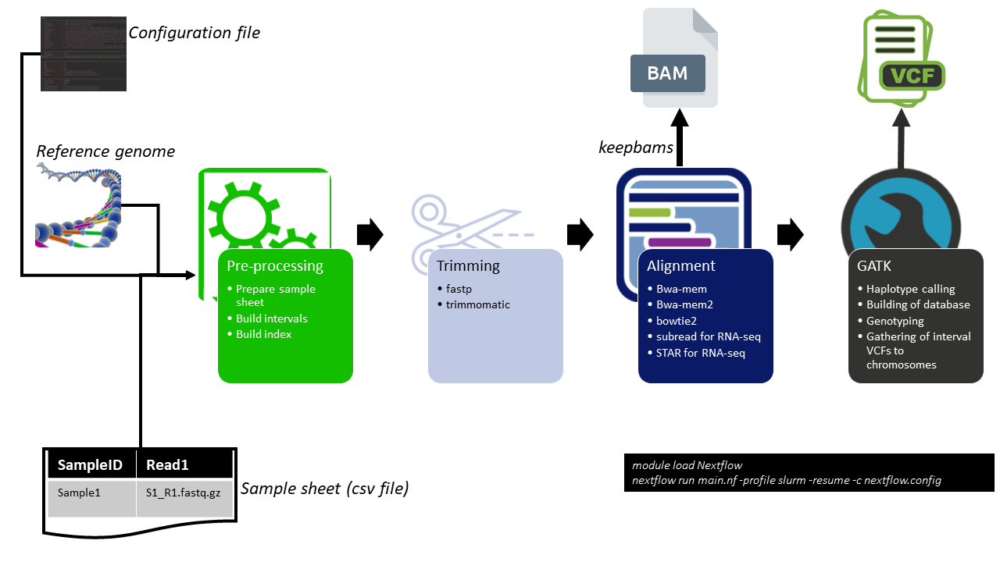

# shortbread2

Shortbread2 is a bioinformatics pipeline for identifying single nucleotide polymorphisms (SNPs) and
insertions/deletions (indels) from High-Throughput Next Generation Sequencing (NGS) data. It is based on the [GATK Best
Practices](https://gatk.broadinstitute.org/hc/en-us/articles/360035894711-About-the-GATK-Best-Practices) for performing
variant discovery analysis in NGS data. Shortbread2 uses [Nextflow](https://www.nextflow.io/), a domain-specific language (DSL) for defining
workflows, as its workflow management tool. This means that the steps for processing NGS data are defined in the
pipeline formally in terms of inputs, processing, and outputs. Nextflow then handles the submission of jobs and the connection of outputs
from one step to the inputs of the next. 

The shortbread2 pipeline has significantly reduced the time it takes to process variant calling data. 
Previously, variant calling could take months to complete. However, shortbread2 can process the same data in just a few
days. The shortbread2 pipeline is a valuable tool for researchers who need to process large amounts of data quickly. 
It can help to save researchers time and money, and it can also help to make variant calling more accessible to a wider
range of researchers.

The shortbread2 pipeline is broadly split into 3 steps as summarised in the figure below.
1. **Pre-processing** \
The preprocessing step includes the following steps:
* Creating a sample sheet: This is a file that contains information about the samples that were sequenced, such as the
  sample name, paths to raw read files, and the sequencing platform.
* Trimming the raw sequence data: This removes unwanted sequences from the beginning and end of the reads, such as
  adapters and low-quality bases.
* Aligning the reads to the reference genome: This matches the reads to the known sequence of a reference genome.
* Cleaning up the alignment: This removes duplicate reads and incorrect alignments, and it also corrects for technical
  biases in the data.
  These steps are important to ensure that the data is of high quality and that it is ready for downstream analysis.

2. **Variant discovery** \
Variant calling is performed on the analysis-ready BAM files from step 1 using tools from the GATK software toolkit. 
The output of variant calling from shortbread2 is in VCF format.

3. **Additional steps** \
shortbread2 also includes the following additional steps: 
* Filtering of variants: This removes false positives from the variants that were called in Step 2. This is done by
  applying a set of user-defined criteria to the variants, such as the minimum number of reads that support a variant
  and the minimum quality score of the reads.
* Generation of sequencing quality and variant quality reports: This creates reports that summarise the quality of the
  sequencing data and the quality of the variants that were called. These reports can be used to assess the quality of
  the data and to identify potential problems.


[](http://nextflow.io)


## Getting started
* Load nextflow using the 'module load' option if running on HPC
  ```bash
  module purge
  module load Nextflow 
  ```
* Alternatively, you can install Nextflow by using the following command (optional): 
  ```bash
  wget -qO- https://get.nextflow.io | bash 
  ```

* Download shortbread, and cd to the shortbread directory
    
  ```bash
  git clone https://github.com/plantinformatics/shortbread2.git
  cd shortbread2
  ```
* Running shortbread with default parameters
 
To test if shortbread is set up properly, run shortbread to get to the help page;

```bash
nextflow run main.nf --mode test
```
Alternatively, you can test shortbread on the included test dataset by running the following

```bash
nextflow run main.nf --paramfile test
```
This runs shortbread on the local host using the default parameters included in the [*params.config*](nextflow.config) file.

## Running shortbread

### Running shortbread in test mode
You can run shortbread in test mode by setting the parameter (--mode 'test'). This runs shortbread2 on a randomly selected set of 2 sample IDs and 5 intervals.
```bash
module purge 
module load Nextflow
nextflow run main.nf --mode 'test' --paramfile test
```

### Running shortbread in production mode

To run shortbread in production mode, set mode to 'prod'. This allows shortbread to run the analysis on the entire dataset.

```bash
module purge 
module load Nextflow
nextflow run main.nf --mode 'prod' --paramfile test
```

## Start running your own analysis!

To run your own analysis you will need the following;
- A fasta file for the reference genome
- Path to index of the reference genome if it exists - see choice of aligner below
- Samplesheet - a csv file with at least 2 columns (SampleID, Full path to Read1)
- Path to the directory where final results will be saved
- Large working directory
### Before you get started
**NOTE:** 
*If running shortbread2 using Putty or a standard terminal, the Nextflow session will end when the putty/terminal session ends and all submitted jobs to HPC will be terminated. To launch shortbread2 persistently in the background, use the nohup command or screen*

  **Running shortbread in interactive mode**
  ```
    #Interactive session
    nextflow run main.nf -profile slurm -resume --mode prod [--paramfile 'Absolute path to parameter config file' | --param1 value1 --param2 value2 ... --param-n value-n]
  ```
  **Run shortbread in the background using nohup**
  ```{bash}
    #background session using nohup as follows with the -bg option
    nohup nextflow run main.nf -profile slurm -resume --mode prod [--paramfile 'Absolute path to parameter config file' | --param1 value1 --param2 value2 ... --param-n value-n] -bg &
  ```
   **Run shortbread as a job on HPC**
  
  Edit [*'Submit-shortbread-job.sh'*](Submit-shortbread-job.slurm) SLURM script and *sbatch* this to **HPC**.
  *Take note of the path to the location where shortbread is located*
  ```{bash}
  sbatch Submit-shortbread-job.sh
  ```

### Highly recommended- edit [*params.config*](params.config) file

It's recommended to use the [*params.config*](params.config) file to add all the parameters and then run shortbread as;

```bash
nextflow run main.nf -profile slurm -resume --paramfile [*params.config*](params.config)
```
Alternatively, you can save the [*params.config*](params.config) file with a different name e.g 'IPK-wheat-params.config' and use this with Nextflow as follows;

```bash
nextflow run main.nf -profile slurm -resume --paramfile IPK-wheat-params.config
```
### Passing parameters on the command line

You can also pass the parameters on the command line as;
```{bash}
nextflow run main.nf --param1 --param2 ... --paramN [other Nextflow arguments]
```
To get a full updated list of the required parameters, run

```bash
nextflow run main.nf --help
```

Below is a list of some of the parameters included in [*params.config*](params.config) 
* **Required parameters**
  ``` 
  --mode            //if mode is set to 'test', the pipeline randomly samples 2 sample IDs, leave blank to run on entire datase
  --emailaddress    //Set email address to receive run updates
  --HPCaccount     //account to be used on HPC, change this to the account associated with the project etc
  --notifications   //Set to false to disable emails, default is true
  --aligner         //Options include 'bwamem', 'bwamem2','bowtie2','subread' or 'star', default is 'bwamem'
  --refgenome       //Path to the fasta file for the reference genome
  --indexdir        //Path to the directory where aligner indexed version of the reference genome will be/is stored
  --indexprefix     //Prefix to current index, set to 'build' to generate a new index
  --outdir          //Path to the directory where the results will be saved
  --trimmethod      //Trimming method used in the trimming step,options include 'fastp' or 'trimmomatic'
  --samplesheet     //Provide a comma delimited sample sheet with at least 2 columns; SampleID,Read1
  --seqtype         //A character string or an integer giving the type of sequencing data. Possible values include ‘rna’ for RNA-seq data and ‘dna’ genomic DNA-seq data such as Whole Genome Sequence (WGS), Whole Exome Sequence (WES), ChIP-seq, HiC-seq, ATAC-seq data etc.
  ```

* **Optional parameters**
  ```
  //============================Skip tools========================================================================================================
    --fastqc  //set to true to skip fastqc step
    --alignment //if bams exist, set to true and provide path to bam files to the 'bamdir' parameter
    --bamdir "" //if bam files exist, specify path to bam files and set alignment to true
    --markduplicates //Set to true to skip the markduplicates step
    --gatk //Set to true to skip the gatk steps

    //============================Other options====================================================================================================
    --MASK      // Not in use
    --OFFSET    //Used in trimmomatic
    --RGPL      //name of the sequencing platform
    --keepbams  //Whether to keep or delete merged bam files
    --keeptrimmedfqs //Whether to retain trimmed files
    --mappingquality //Filtering option passed to samtools to filter reads with mapping quality below the value
    --samtoolsoptions //Extra options passed to samtools view, see samtools view --help for more options
    //============================Options for GATK tools=========================================================================================
    --intervalsizegatk 100000000 //Interval size to be used in GATK steps
    --GATKHaplotypeoptions //Any extra parameters to GATK haplotype caller
    --GATKDBImportoptions  //Any extra parameters to GATK GenomicsDBImport
    --GATKGenotypingoptions //Any extra parameters to GATK GenotypeGVCFs
    --GATKupdateexistingdb //Set true if you want to add new samples to an already existing database
    --GATKpathtodbs //Set path to existing GATKDBImport databases
    //============================VCF-filtering-options==============================================================================================
    --MAFbcf 0.001 //Minor allele frequency - used for filtering variants in VCF
    --CRbcf 30  //Calling rate - fraction of samples in which the variant is present
    --ACbcf 3   //Allele count in genotypes,
    --MQbcf 30  //RMS Mapping Quality
    --FSbcf 60.0 //Phred-scaled p-value using Fisher's exact test to detect strand bias
    --MQRankSumbcf -12.5 //Z-score From Wilcoxon rank sum test of Alt vs. Ref read mapping qualities
    --ReadPosRankSumbcf -8.0 //Z-score from Wilcoxon rank sum test of Alt vs. Ref read position bias
    --SORbcf 3.0 //Symmetric Odds Ratio of 2x2 contingency table to detect strand bias
    --QDbcf 2.0 //Variant Confidence/Quality by Depth
    //============================Software versions===============================================================================================
    --usedefaults false //Option to allow shortbread to load default modules on HPC, set to false to use different versions
    --gatkversion "4.4.0.0-GCCcore-11.2.0-Java-17"
    --samtoolsversion "1.17-GCC-11.2.0"
    --HTSlibversion "1.17-GCC-11.2.0.lua"
    --BCFtoolsversion "1.17-GCC-11.2.0.lua"
    --fastptrimversion "0.20.0-foss-2019a"
    --trimmomaticversion "0.38-Java-1.8"
    --picardversion "3.0.0-Java-17"
    --bwamemalignerversion "0.7.17-intel-2019a"
    --bwamem2alignerversion "2.1-GCC-9.3.0"
    --bowtie2alignerversion "2.4.5-GCC-11.2.0"
    --staralignerversion "2.7.10b-GCC-11.2.0"
    --subreadalignerversion "2.0.0-foss-2019a"
    --fastqcversion "0.11.8-Java-1.8"
    --multiqcversion "1.9-foss-2020a-Python-3.8.2"
  ```


**Aligner options in shortbread2**

Shortbread includes 5 aligners which can be set using the '--aligner' parameter. Options include 'bwamem' for BWA,'bwamem2' for BWA2, 'bowtie2' for Bowtie2, 'star' for STAR or 'subread' for Subread.
<table>
<thead>
<tr><th>Aligner</th><th>Description</th><th>Features</th></tr>
</thead>
<tbody>
<tr>
<td> <a href="https://github.com/lh3/bwa" target="_blank">BWA-mem</a></td>
<td>BWA is a software package for mapping low-divergent sequences against a large reference genome, such as the human genome. It is fast and memory efficient, and can be used to map both DNA and RNA sequences. BWA uses a Burrows-Wheeler transform to speed up the alignment process</td>
<td>Fast, memory efficient, can map DNA and RNA sequences</td>
</tr>
<tr>
<td><a href="https://github.com/bwa-mem2/bwa-mem2" target="_blank">BWA-mem2</a></td>
<td>BWA2 is a new version of BWA that is designed for high-throughput sequencing data. It is faster and more accurate than the original BWA, and can map reads that are longer than the reference genome. BWA2 uses a combination of alignment and statistical methods to improve the accuracy of the alignment process.</td>
<td>Faster and more accurate than the original BWA, can map reads that are longer than the reference genome</td>
</tr>
<tr>
<td>
<a href="https://bowtie-bio.sourceforge.net/bowtie2/index.shtml" target="_blank">Bowtie2</a>
</td>
<td>
Bowtie2 is another popular alignment software package. It is similar to BWA in terms of speed and accuracy, but it can also map reads that are longer than the reference genome. Bowtie2 uses a hash table to speed up the alignment process.
</td>
<td>
Similar to BWA in terms of speed and accuracy, can map reads that are longer than the reference genome
</td>
</tr>
<tr>
<td>
<a href="https://github.com/alexdobin/STAR" target="_blank">STAR</a>
</td>
<td>
STAR is a software package for mapping reads to a reference genome and assembling transcripts. It is designed for high-throughput sequencing data, and can map reads that are longer than the reference genome. STAR uses a combination of alignment and statistical methods to assemble transcripts.
</td>
<td>
Designed for high-throughput sequencing data, can map reads that are longer than the reference genome, assembles transcripts
</td>
</tr>
<tr>
<td>
<a href="https://subread.sourceforge.net/" target="_blank">Subread</a>
</td>
<td>
Subread is a software package for mapping reads to a reference genome and identifying genomic features. It can be used to map DNA, RNA, and cDNA sequences. Subread uses a combination of alignment and statistical methods to identify genomic features.
</td>
<td>
Can map DNA, RNA, and cDNA sequences, identifies genomic features
</td>
</tr>
</tbody>
</table>


# Output from shortbread

Any results generated by Shortbread will be stored in the *SB2-Run* folder which is further subdivided into the following folders
